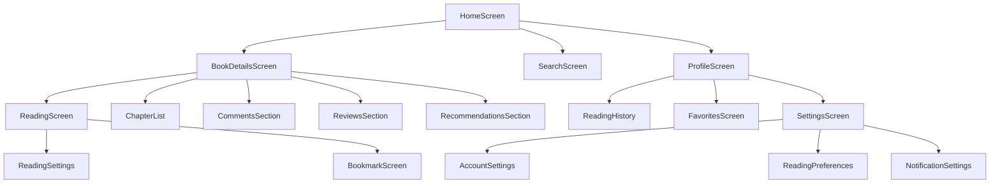
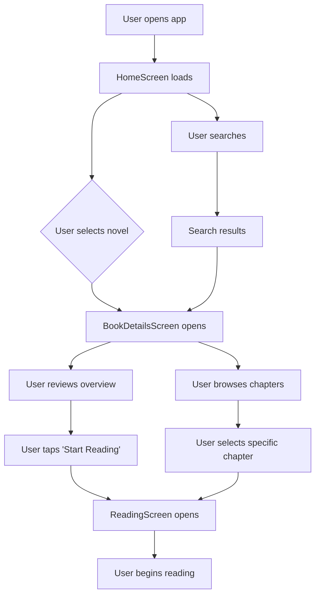
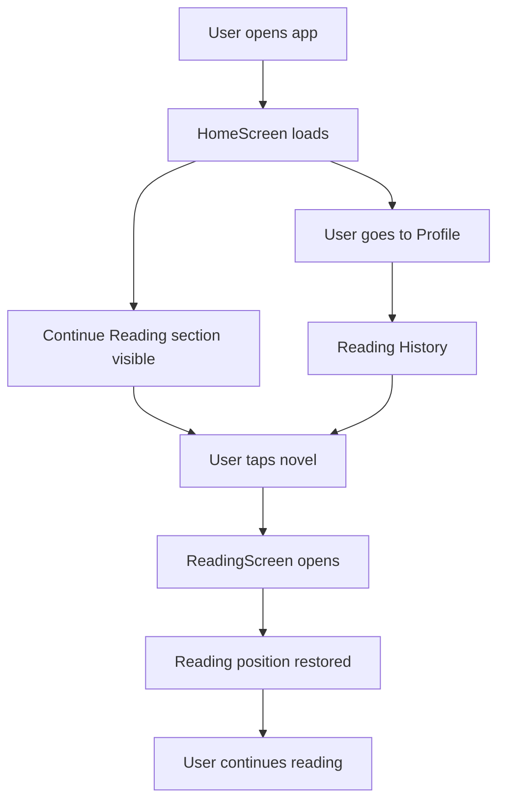
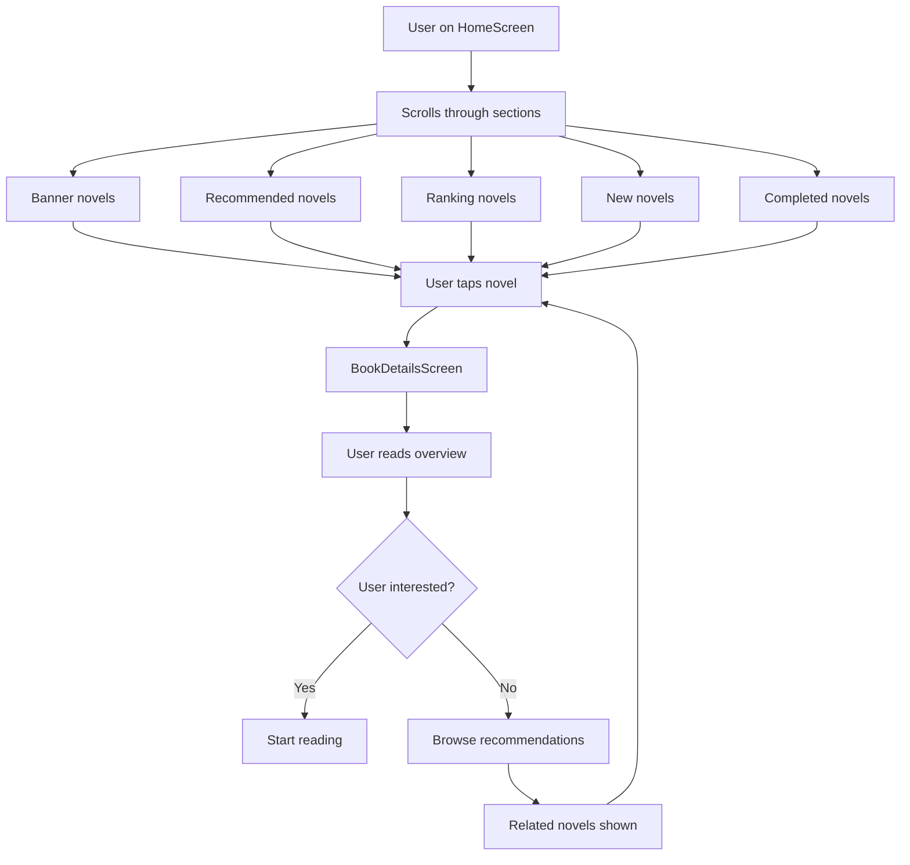

# Novel Reading App UI/UX Specification

## Introduction

This document defines the user experience goals, information architecture, user flows, and visual design specifications for Novel Reading App's user interface. It serves as the foundation for visual design and frontend development, ensuring a cohesive and user-centered experience.

### Overall UX Goals & Principles

#### Target User Personas

- **Casual Novel Reader:** Users who browse and read novels occasionally, prioritizing ease of discovery and simple navigation
- **Avid Reader:** Power users who read frequently, need efficient browsing, bookmarking, and reading progress tracking
- **Social Reader:** Users who engage with reviews, comments, and recommendations, valuing community features

#### Usability Goals

- **Ease of Discovery:** Users can find interesting novels within 3 taps from home screen
- **Seamless Reading:** Reading experience is uninterrupted by UI elements or authentication issues
- **Efficient Navigation:** Users can access any feature within 2-3 taps from any screen
- **Error Prevention:** Clear feedback for all actions, especially authentication and network issues

#### Design Principles

1. **Reading-First Design** - UI elements never interfere with the core reading experience
2. **Progressive Disclosure** - Show essential information first, details on demand
3. **Consistent Patterns** - Maintain familiar navigation and interaction patterns throughout
4. **Immediate Feedback** - Every user action has clear, immediate visual response
5. **Accessible by Default** - Design for all users including those with visual or motor impairments

#### Change Log

| Date | Version | Description | Author |
|------|---------|-------------|---------|
| 2024-12-19 | 1.0 | Initial UI/UX specification created | Sally (UX Expert) |

## Information Architecture (IA)

### Site Map / Screen Inventory

### Navigation Structure

**Primary Navigation:** Bottom navigation bar with Home, Search, Library (Favorites/History), and Profile tabs

**Secondary Navigation:** 
- HomeScreen: Horizontal scrolling sections (Banner, Recommended, Ranking, New, Completed)
- BookDetailsScreen: Tab-based navigation (Overview, Chapters, Comments, Reviews, Recommendations)
- ReadingScreen: Overlay controls for settings, bookmarks, and chapter navigation

**Breadcrumb Strategy:** Contextual breadcrumbs in BookDetailsScreen and ReadingScreen showing: Home > Novel Title > Current Section

## User Flows

### Flow 1: Discover and Start Reading a Novel

**User Goal:** Find an interesting novel and begin reading it

**Entry Points:** HomeScreen banner, recommended section, search results, or recommendations

**Success Criteria:** User successfully opens a novel and begins reading within 3 taps

**Flow Diagram:**

**Edge Cases & Error Handling:**
- Network connectivity issues during novel loading
- Authentication token expiration during reading
- Novel not available or removed
- Chapter loading failures

**Notes:** This is the primary user journey and must be optimized for speed and reliability

### Flow 2: Continue Reading from Where Left Off

**User Goal:** Resume reading a previously started novel

**Entry Points:** HomeScreen "Continue Reading" section, Profile reading history, or bookmarks

**Success Criteria:** User resumes reading within 2 taps, maintaining reading position

**Flow Diagram:**

**Edge Cases & Error Handling:**
- Reading position data corrupted or missing
- Novel no longer available
- Network issues preventing position sync

**Notes:** Critical for user retention and reading continuity

### Flow 3: Browse and Explore Novels

**User Goal:** Discover new novels through browsing and recommendations

**Entry Points:** HomeScreen various sections, BookDetailsScreen recommendations

**Success Criteria:** User can efficiently browse and find novels of interest

**Flow Diagram:**

**Edge Cases & Error Handling:**
- Empty sections due to API failures
- Slow loading of novel images
- Recommendation algorithm failures

**Notes:** This flow drives discovery and should be optimized for engagement

## Wireframes & Mockups

**Primary Design Files:** [To be determined - please specify your preferred design tool (Figma, Sketch, Adobe XD, etc.)]

### Key Screen Layouts

#### HomeScreen Layout
**Purpose:** Main discovery and navigation hub for novel browsing

**Key Elements:**
- App bar with search and profile icons
- Hero banner section with featured novels
- Horizontal scrolling sections: Recommended, Ranking, New, Completed
- Each section with novel cards showing cover, title, author, and rating
- "Continue Reading" section at top for returning users

**Interaction Notes:** Smooth horizontal scrolling, pull-to-refresh, infinite scroll for sections

**Design File Reference:** [To be specified]

#### BookDetailsScreen Layout
**Purpose:** Comprehensive novel information and chapter access

**Key Elements:**
- Novel cover image and basic info (title, author, rating, status)
- Tab navigation: Overview, Chapters, Comments, Reviews, Recommendations
- Overview tab: Description, genre tags, reading progress
- Chapters tab: List of chapters with progress indicators
- Comments/Reviews tabs: User-generated content with interaction options
- Recommendations tab: Related novels with similar themes

**Interaction Notes:** Smooth tab transitions, chapter list with progress tracking, social interaction features

**Design File Reference:** [To be specified]

#### ReadingScreen Layout
**Purpose:** Immersive reading experience with minimal UI interference

**Key Elements:**
- Full-screen text content with optimized typography
- Overlay controls (appear on tap): Settings, bookmarks, chapter navigation
- Reading progress indicator
- Chapter navigation (previous/next)
- Reading settings panel: Font size, theme, line spacing
- Bookmark and note-taking capabilities

**Interaction Notes:** Tap to show/hide controls, swipe gestures for chapter navigation, persistent reading position

**Design File Reference:** [To be specified]

## Component Library / Design System

**Design System Approach:** Enhance existing Material 3 design system with reading-specific components and improved visual hierarchy while maintaining consistency with current theme configuration

### Core Components

#### Enhanced NovelCard Component
**Purpose:** Display novel information in various contexts (home sections, search results, recommendations)

**Variants:** 
- Standard card (cover + title + author + rating)
- Compact card (smaller for dense layouts)
- Featured card (larger for banners and highlights)
- List item variant (horizontal layout for rankings)

**States:** Default, loading (skeleton), error, selected, disabled

**Usage Guidelines:** Use standard variant for most contexts, compact for dense lists, featured for banners, list item for rankings

#### Enhanced BannerCard Component
**Purpose:** Showcase featured novels with improved animations and visual appeal

**Variants:**
- Hero banner (full-width with overlay text)
- Carousel item (swipeable banner)
- Grid banner (multiple featured items)

**States:** Default, loading, error, auto-advancing (for carousel)

**Usage Guidelines:** Use hero for main featured content, carousel for multiple features, grid for category highlights

#### Improved RankingListItem Component
**Purpose:** Display novels in ranking lists with better spacing and visual hierarchy

**Variants:**
- Standard ranking (number + novel info)
- Compact ranking (for dense lists)
- Detailed ranking (with additional metrics)

**States:** Default, loading, selected, disabled

**Usage Guidelines:** Use standard for most rankings, compact for long lists, detailed for comprehensive rankings

#### Complete CommentItem Component
**Purpose:** Display user comments with reply functionality and interaction options

**Variants:**
- Standard comment (text + user info)
- Reply comment (indented with reply indicator)
- Comment with media (if image attachments are supported)

**States:** Default, loading, expanded (showing replies), collapsed, error

**Usage Guidelines:** Use standard for top-level comments, reply for nested comments, media variant when attachments exist

#### Enhanced ReviewItem Component
**Purpose:** Display user reviews with better rating display and interaction options

**Variants:**
- Standard review (rating + text + user info)
- Compact review (summary view)
- Detailed review (full review with helpful votes)

**States:** Default, loading, expanded, collapsed, error

**Usage Guidelines:** Use standard for most reviews, compact for review summaries, detailed for full review display

#### Improved ChapterItem Component
**Purpose:** Display chapter information with progress indicators and navigation

**Variants:**
- Standard chapter (title + progress indicator)
- Chapter with preview (title + progress + preview text)
- Locked chapter (for premium content)

**States:** Default, loading, completed, in-progress, locked, error

**Usage Guidelines:** Use standard for most chapters, preview for chapter browsing, locked for premium content

#### Better Loading States and Error Handling Components
**Purpose:** Provide consistent feedback for loading and error states

**Variants:**
- Skeleton screens (for content loading)
- Progress indicators (for actions)
- Error states (with retry options)
- Empty states (for no content)

**States:** Loading, error, empty, success

**Usage Guidelines:** Use skeleton for content loading, progress for actions, error with retry options, empty for no content scenarios

## Branding & Style Guide

### Visual Identity
**Brand Guidelines:** [To be specified - please provide existing brand guidelines or confirm if we should create new ones]

### Color Palette

| Color Type | Hex Code | Usage |
|------------|----------|-------|
| Primary | #6750A4 | Primary buttons, links, and key interactive elements |
| Secondary | #625B71 | Secondary actions and supporting elements |
| Accent | #7D5260 | Highlights, badges, and special indicators |
| Success | #4CAF50 | Positive feedback, confirmations, completed states |
| Warning | #FF9800 | Cautions, important notices, pending states |
| Error | #F44336 | Errors, destructive actions, failed states |
| Neutral | #49454F, #79747E, #CAC4D0 | Text, borders, backgrounds, and subtle elements |

### Typography

#### Font Families
- **Primary:** Roboto (Material 3 default)
- **Secondary:** Roboto Condensed (for compact displays)
- **Monospace:** Roboto Mono (for code or special formatting)

#### Type Scale

| Element | Size | Weight | Line Height |
|---------|------|--------|-------------|
| H1 | 32sp | Bold (700) | 40sp |
| H2 | 28sp | Bold (700) | 36sp |
| H3 | 24sp | Medium (500) | 32sp |
| Body | 16sp | Regular (400) | 24sp |
| Small | 14sp | Regular (400) | 20sp |

### Iconography
**Icon Library:** Material Design Icons with custom reading-specific icons

**Usage Guidelines:** Use standard Material icons for common actions, custom icons for reading-specific features (bookmark, reading progress, etc.)

### Spacing & Layout
**Grid System:** 8dp base grid system for consistent spacing

**Spacing Scale:** 4dp, 8dp, 16dp, 24dp, 32dp, 48dp, 64dp for consistent component spacing

## Accessibility Requirements

### Compliance Target
**Standard:** WCAG 2.1 AA compliance with enhanced support for reading accessibility

### Key Requirements

**Visual:**
- Color contrast ratios: Minimum 4.5:1 for normal text, 3:1 for large text (18pt+)
- Focus indicators: Clear, high-contrast focus rings for all interactive elements
- Text sizing: Support for system font scaling up to 200% without horizontal scrolling

**Interaction:**
- Keyboard navigation: Full app navigation using external keyboard or switch control
- Screen reader support: Complete semantic markup with proper labels and descriptions
- Touch targets: Minimum 44dp touch targets for all interactive elements

**Content:**
- Alternative text: Descriptive alt text for all novel covers and images
- Heading structure: Proper heading hierarchy (H1-H6) for screen reader navigation
- Form labels: Clear, descriptive labels for all form inputs and controls

### Testing Strategy
- Automated testing with accessibility scanners
- Manual testing with screen readers (TalkBack for Android)
- User testing with users who have disabilities
- Regular accessibility audits during development

## Responsiveness Strategy

### Breakpoints

| Breakpoint | Min Width | Max Width | Target Devices |
|------------|-----------|-----------|----------------|
| Mobile | 320dp | 599dp | Small phones, compact devices |
| Tablet | 600dp | 839dp | Tablets, large phones in landscape |
| Desktop | 840dp | - | Large tablets, desktop (if supported) |

### Adaptation Patterns

**Layout Changes:**
- Mobile: Single column layout with vertical scrolling
- Tablet: Two-column layout for novel lists, larger reading area
- Desktop: Multi-column layout with sidebar navigation

**Navigation Changes:**
- Mobile: Bottom navigation bar
- Tablet: Bottom navigation with additional secondary navigation
- Desktop: Side navigation drawer with expanded menu options

**Content Priority:**
- Mobile: Essential content first, progressive disclosure for details
- Tablet: More content visible at once, better use of screen real estate
- Desktop: Full content display with efficient navigation

**Interaction Changes:**
- Mobile: Touch-optimized with swipe gestures
- Tablet: Touch with hover states for better feedback
- Desktop: Mouse and keyboard optimized with hover effects

## Animation & Micro-interactions

### Motion Principles
- **Purposeful Motion:** Every animation serves a functional purpose, not just decoration
- **Reading-First:** Animations never interfere with the reading experience
- **Subtle and Smooth:** Gentle transitions that feel natural and responsive
- **Performance-Conscious:** Animations that don't impact app performance or battery life
- **Accessibility-Aware:** Respect user preferences for reduced motion

### Key Animations

- **Page Transitions:** Smooth slide transitions between screens (Duration: 300ms, Easing: EaseInOut)
- **Novel Card Interactions:** Subtle scale and shadow effects on tap (Duration: 150ms, Easing: EaseOut)
- **Loading States:** Skeleton screen animations with shimmer effect (Duration: 1000ms, Easing: Linear)
- **Chapter Navigation:** Smooth page turn animations in reading mode (Duration: 400ms, Easing: EaseInOut)
- **Tab Switching:** Fade and slide transitions between tabs (Duration: 250ms, Easing: EaseInOut)
- **Pull-to-Refresh:** Elastic bounce animation with loading indicator (Duration: 500ms, Easing: EaseOut)
- **Error States:** Gentle shake animation for error feedback (Duration: 200ms, Easing: EaseInOut)
- **Success Feedback:** Subtle checkmark animation for completed actions (Duration: 300ms, Easing: EaseOut)

## Performance Considerations

### Performance Goals
- **Page Load:** Initial app launch within 2 seconds, screen transitions within 500ms
- **Interaction Response:** All user interactions respond within 100ms
- **Animation FPS:** Maintain 60fps for all animations and transitions

### Design Strategies
- **Lazy Loading:** Load novel covers and content progressively to improve initial load times
- **Image Optimization:** Use appropriate image sizes and formats for different screen densities
- **Skeleton Screens:** Show loading placeholders to maintain perceived performance
- **Efficient Scrolling:** Optimize list rendering for smooth scrolling through large novel collections
- **Memory Management:** Design components to minimize memory usage and prevent leaks
- **Network Optimization:** Implement smart caching and offline capabilities for reading content

## Next Steps

### Immediate Actions

1. **Review and validate the UI/UX specification with stakeholders**
2. **Create detailed visual designs in your preferred design tool (Figma, Sketch, etc.)**
3. **Develop component prototypes to test interaction patterns**
4. **Conduct user testing with key user flows and components**
5. **Prepare handoff documentation for development team**
6. **Set up design system documentation and component library**
7. **Plan accessibility testing and validation**
8. **Schedule regular design reviews during development**

### Design Handoff Checklist

- [ ] All user flows documented
- [ ] Component inventory complete
- [ ] Accessibility requirements defined
- [ ] Responsive strategy clear
- [ ] Brand guidelines incorporated
- [ ] Performance goals established

## Checklist Results

This UI/UX specification has been created following the front-end-spec template workflow. All sections have been completed with stakeholder input and are ready for design implementation and development handoff.
